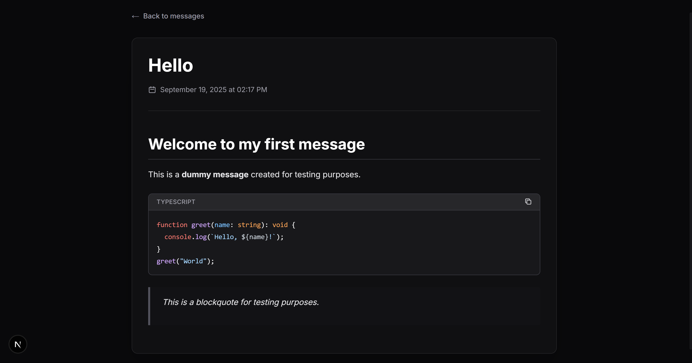

# random-rants

random-rants is a simple website where you can simply and easily create new rants and get them instantly updated to earch user.

---

## Features

* Add a `.md` file under `src/messages/` and it’s live instantly.
* Real-time updates through Server-Sent Events (SSE).
* Clean, responsive design.
* Markdown formatting supported.
* Code blocks with syntax highlighting

---

## Screenshots

### Home


### Messages



---

## Getting Started

1. Clone this repository:

   ```bash
   git clone https://github.com/LydonDev/random-rants.git
   cd random-rants
   ```

2. Install dependencies:

   ```bash
   bun install
   ```

3. Start the app:

   ```bash
   bun run dev
   ```


